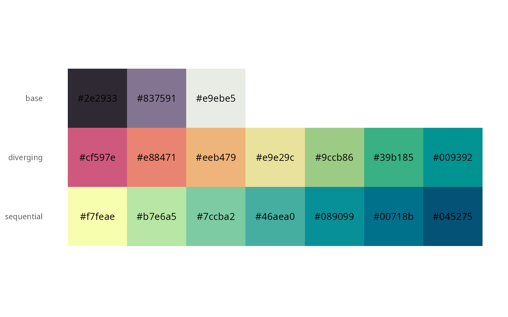

<!-- Kommunikationsdaten umfassen Informationen, die bei der Interaktion zwischen Personen oder zwischen Personen und Geräten anfallen. Dazu gehören nicht nur die unmittelbaren Inhalte der Kommunikation, sondern auch verschiedene Metadaten wie Sender- und Empfängerinformationen, Zeitstempel, Betreffzeilen und mehr. Diese Daten können aus verschiedenen Quellen stammen, wie E-Mails, Textnachrichten, Chatprotokollen, sozialen Medien, Kundenanfragen und Kundenbefragungen. Für hessische Unternehmen können diese Kommunikationsdaten eine wertvolle Informationsquelle darstellen, deren Analyse wirtschaftlichen Mehrwert generieren kann.. -->
 

Kommunikationsdaten entstehen bei der Interaktion zwischen Menschen und Geräten -- sei es durch E-Mails, Projektberichte, soziale Medien oder Kundenanfragen. Diese Daten enthalten wertvolle Informationen, die Unternehmen helfen können, Einblicke zu gewinnen, Prozesse zu verbessern und Entscheidungen auf einer fundierten Basis zu treffen. Doch oft bleiben diese Daten ungenutzt, da sie unstrukturiert vorliegen und ihre Analyse zeitaufwendig erscheint. Jedoch existieren computergestützte Verfahren, die die automatisierte Analyse unstrukturierter Kommunikationsdaten ermöglichen. So können große Datenmengen in kurzer Zeit ausgewertet werden.

<!--   -->
<!-- Da diese Daten häufig in Textform vorliegen, eröffnen computergestützte Ansätze neue Möglichkeiten zur Auswertung. Im Vergleich zur manuellen Analyse ermöglichen diese Technologien die automatisierte Bearbeitung großer Datenmengen mit angemessenem Aufwand. -->

Unsere Website bietet Ihnen eine Übersicht der vielfältigen Werkzeuge, mit denen Kommunikationsdaten analysiert und genutzt werden können. Von den Grundlagen dieser Daten über Methoden, diese zu strukturieren und auszuwerten, bis hin zu praktischen Anwendungen -- entdecken Sie, wie diese Methoden dazu beitragen können, wertvolle Erkenntnisse aus Kommunikationsdaten zu gewinnen.

 Auf dieser Webseite werden einige dieser **Methoden** erklärt und anhand von **Fallstudien** exemplarisch demonstriert. 

## Methoden










## Fallstudien













## Palette

