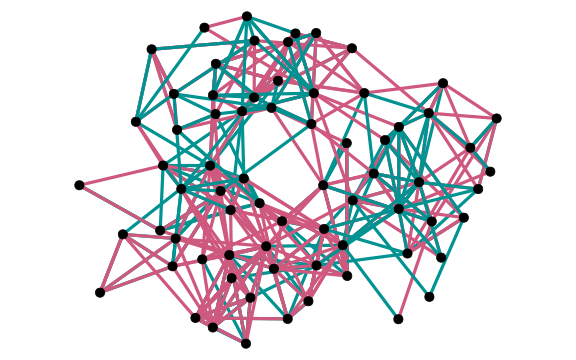

<!-- Kommunikationsdaten umfassen Informationen, die bei der Interaktion zwischen Personen oder zwischen Personen und Geräten anfallen. Dazu gehören nicht nur die unmittelbaren Inhalte der Kommunikation, sondern auch verschiedene Metadaten wie Sender- und Empfängerinformationen, Zeitstempel, Betreffzeilen und mehr. Diese Daten können aus verschiedenen Quellen stammen, wie E-Mails, Textnachrichten, Chatprotokollen, sozialen Medien, Kundenanfragen und Kundenbefragungen. Für hessische Unternehmen können diese Kommunikationsdaten eine wertvolle Informationsquelle darstellen, deren Analyse wirtschaftlichen Mehrwert generieren kann.. -->
<!--  
 -->



  Einsatz neuer Daten in Kommunikationszusammenhängen auf Unternehmensebene (EnDiKaU)     ***Förderprogramm Distr@l Digitalisierung***  

 Kommunikationsdaten entstehen bei der Interaktion zwischen Menschen und Geräten - sei es durch E-Mails, Projektberichte, soziale Medien oder Kundenanfragen.   Diese Daten enthalten wertvolle Informationen, die Unternehmen helfen können, Einblicke zu gewinnen, Prozesse zu verbessern und Entscheidungen auf einer fundierten Basis zu treffen. Doch oft bleiben diese Daten ungenutzt, da sie unstrukturiert vorliegen und ihre Analyse zeitaufwendig erscheint. Jedoch existieren computergestützte Verfahren, die die automatisierte Analyse unstrukturierter Kommunikationsdaten ermöglichen. So können große Datenmengen in kurzer Zeit ausgewertet werden. 




      
    




 Unsere Website bietet Ihnen eine Übersicht der vielfältigen Werkzeuge, mit denen Kommunikationsdaten analysiert und genutzt werden können. Von den Grundlagen dieser Daten über Methoden, diese zu strukturieren und auszuwerten, bis hin zu praktischen Anwendungen -- entdecken Sie, wie diese Methoden dazu beitragen können, wertvolle Erkenntnisse aus Kommunikationsdaten zu gewinnen. 
<!-- Auf dieser Webseite werden einige dieser **Methoden** erklärt und anhand von **Fallstudien** exemplarisch demonstriert.  -->




 

## Methoden

Lorem ipsum dolor sit amet, ac sociosqu quis gravida nibh aliquam magnis auctor eu ante et. Amet nec integer tortor sed id dictumst finibus. Etiam mattis vivamus hendrerit diam turpis ac. Purus vitae sed nunc. Facilisi dapibus tellus imperdiet vel. Urna pellentesque cras, habitasse sem sollicitudin gravida tortor quam maecenas. Eros cum, pharetra mauris aliquam quam ligula interdum hac viverra convallis. Sagittis senectus sed, pellentesque eu, dictum quis praesent, velit sed in, non! Vel nec id faucibus montes rutrum a porta. Tincidunt aliquam integer quam volutpat massa quisque posuere venenatis suspendisse ipsum.










 

 

## Fallstudien

Lorem ipsum dolor sit amet, dolor ac mollis ac in, phasellus. Porttitor sed, blandit dui tincidunt ultricies gravida vel, dui himenaeos luctus rhoncus. Eu, at sed curabitur at vitae. Libero sit ornare neque sed rhoncus sed vulputate sed eget pellentesque nibh. Sed litora nullam semper faucibus, vivamus malesuada natoque tristique porttitor torquent viverra. Sed senectus a, tempor viverra blandit ad ut, erat arcu ligula sit eu malesuada. Condimentum accumsan volutpat mauris sed, massa. Nisl litora sed etiam viverra mattis. Enim neque suspendisse ut risus. Neque ut vitae ex, a. Varius vulputate cras sodales aliquam vestibulum. Mattis felis nunc eu lorem tempus, mus ac ac orci id sem fermentum.
















 

 

## Palette

## Emojis

📧📨📄👥👤🗣️🌐📱📰📣

 
